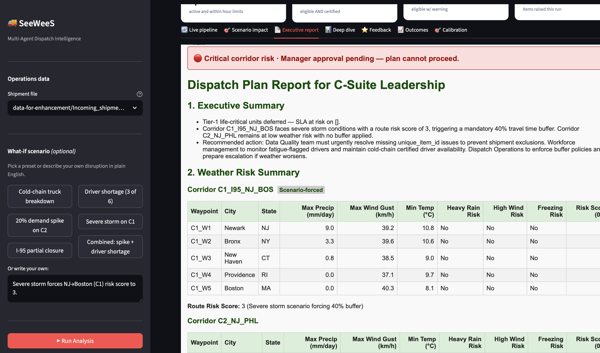
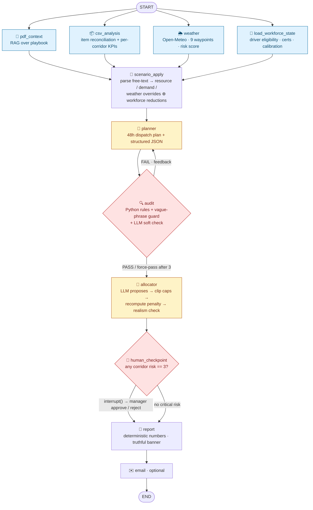
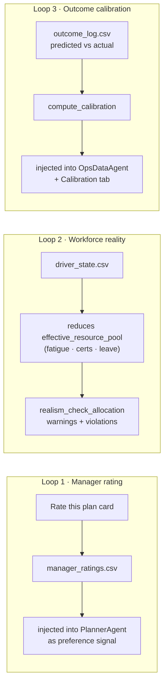
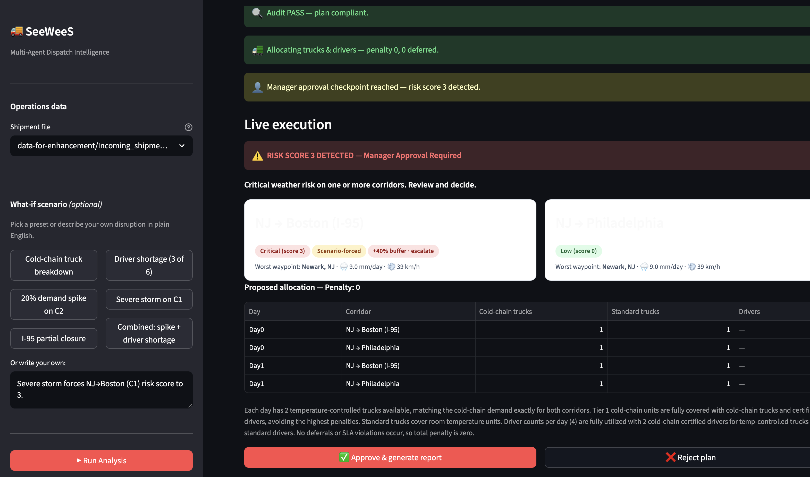
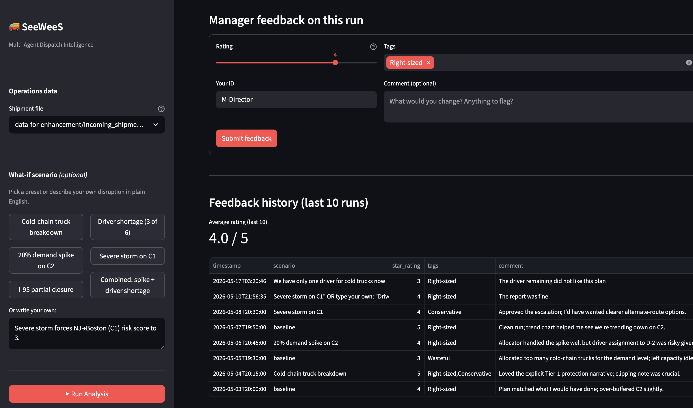

# SeeWeeS Multi-Agent Dispatch Intelligence

A LangGraph-based multi-agent system that turns SeeWeeS' specialty-medicine
operations data into an executive-ready dispatch report. The pipeline ingests
the operations playbook (PDF), 14 days of multi-corridor shipment data (CSV),
and live weather forecasts; runs a six-agent reasoning pipeline with a
self-correcting audit loop, deterministic resource allocation, and a
human-in-the-loop checkpoint; and returns a colour-coded HTML report.


<sub>The executive HTML report — colour-coded status banner, per-corridor weather table with scenario-forced tags, and deterministic deferral numbers. (Run: storm forces C1 to risk 3 → manager approval required.)</sub>

---

## Architecture (LangGraph)



**The only cycle** is `audit → planner` (self-correction). **The only interrupt**
is `human_checkpoint` (suspends the graph for a manager decision when any
corridor hits weather risk 3). Everything else is a linear, observable flow.

### Three feedback loops close the gap between proxy penalty and real-world fitness



---

## Detailed process flow

What happens, end to end, on one run:

1. **Parallel data gathering** (4 nodes run concurrently)
   - `pdf_context` — RAG retrieves business rules from the playbook PDF (Chroma + OpenAI embeddings) and `ContextAgent` structures them.
   - `csv_analysis` — reconciles the shipment CSV against the Item Master (legacy-ID remap, name-alias resolution, DQ-01…04), computes per-corridor / per-day KPIs, and loads outcome calibration.
   - `weather` — pulls Open-Meteo forecasts for all 9 waypoints, scores each 0–3, takes the corridor max.
   - `load_workforce_state` — parses `driver_state.csv` into eligible drivers, cold-chain-certified count, and fatigue flags; loads recent manager ratings.
2. **scenario_apply** — `ScenarioParserAgent` turns the user's free-text scenario into structured overrides (resource caps, demand multipliers, weather/closure, transit delay). These are applied to `effective_resource_pool`, `corridor_kpis`, and `weather_risk`. Workforce reality is layered on top (e.g. cold-chain trucks capped by certified-driver count).
3. **planner** — `PlannerAgent` writes a 48-hour prose plan **plus** a structured JSON block (buffers, escalation, SLA-risk flags).
4. **audit (cyclic)** — deterministic Python checks (buffer policy, escalation rule, vague-phrase guard) run first; if they pass, an `AuditAgent` LLM soft-check assesses executive-readiness. On `FAIL`, control loops back to the planner with the specific violations (max 3 retries, then force-pass with a banner).
5. **allocator** — `AllocatorAgent` proposes truck/driver allocation; then three **deterministic** corrections run in Python: `_clip_resource_allocation` (enforce every per-day cap), `_recompute_penalty` (rebuild penalty + per-tier deferral breakdown from supply × demand), `realism_check_allocation` (workforce feasibility — fatigue, certs, trucks-need-drivers).
6. **human_checkpoint** — if any corridor risk == 3, `interrupt()` suspends the graph until a manager approves or rejects. Otherwise it passes straight through.
7. **report** — `ReportAgent` renders the executive HTML. All numbers are quoted verbatim from the deterministic source; the status banner follows a strict rule set; the approval section reflects the real `human_approved` flag.
8. **email** — optional SMTP send (skips cleanly if unconfigured).

---

## Enhancements implemented (all 5 + a validation layer)

| # | Idea | Where it lives |
|---|---|---|
| 1 | **Self-Correction & Audit Loop** | `node_audit` + `_route_after_audit` cyclic edge in `src/graph.py`; Python hard-rule checks (buffer policy, escalation, vague-phrase guard) followed by `AuditAgent` GPT soft-check. Max 3 retries before force-pass with violation flag. |
| 2 | **What-if Scenario Simulation (truly agentic)** | `ScenarioParserAgent` extracts structured overrides from free-text — `resource_overrides`, `demand_multipliers`, `weather_overrides`, `corridor_closures`, `transit_delay_hours`. `node_scenario_apply` applies them to `effective_resource_pool`, `corridor_kpis`, and `weather_risk` so downstream nodes execute the disruption, not narrate it. |
| 3 | **Deep-Dive Trend & Item Master Reconciliation** | `_reconcile_row` + `ReconciliationLog` in `src/tools/csv_tools.py` map legacy IDs and name aliases to a canonical item master; `_compute_corridor_kpis` produces per-corridor / per-day Tier-1/Tier-2 mix, cold-chain demand, and 7-day trend. |
| 4 | **Human-in-the-Loop Workflow** | `node_human_checkpoint` calls `langgraph.types.interrupt(...)` when `max(route_risk_score) >= 3`. State separately tracks `human_approval_required` (true only when interrupt fires) and `human_approved` so the report can't fabricate approval reasons. |
| 5 | **Multi-Region Resource Planning** | `node_allocator` + `AllocatorAgent` with deterministic post-corrections: `_clip_resource_allocation` clips ALL scarce resources (cold-chain trucks, standard trucks, drivers) to the per-day cap; `_recompute_penalty` rebuilds the penalty score AND a structured `deferral_breakdown` per (corridor, day, tier) that the report agent must quote verbatim. |
| 6 | **Validation / Realism Layer** *(new)* | Three feedback loops: `feedback/driver_state.csv` reduces `effective_resource_pool` by fatigue / certification / leave (`apply_workforce_to_pool`); `realism_check_allocation` raises warnings (fatigue flags, no-slack situations) and violations (cold-chain trucks without certified drivers); `feedback/manager_ratings.csv` is loaded as recent-feedback context for the planner; `feedback/outcome_log.csv` produces a calibration headline injected into the OpsDataAgent prompt. |

---

## Project structure

```
.
├── src/
│   ├── main.py                 # CLI entry point — runs the full graph
│   ├── graph.py                # LangGraph StateGraph, AppState, all 9 nodes
│   ├── agents.py               # 6 GPT agent functions (gpt-4.1-mini, T=0.2)
│   ├── prompts.py              # ChatPromptTemplate for each agent
│   ├── tracing.py              # LangSmith init
│   └── tools/
│       ├── pdf_tools.py        # RAG: PyPDFLoader + Chroma + OpenAI embeddings
│       ├── csv_tools.py        # Reconciliation, per-corridor KPIs, anomalies
│       ├── weather_tools.py    # Open-Meteo client + risk scoring
│       └── email_tools.py      # SMTP report sender
│
├── app.py                      # Streamlit UI — interactive run + approval
├── stress_test_scenarios.py    # Batch what-if simulator (6 scenarios)
├── generate_synthetic_data.py  # Synthetic-shipment generator (6 profiles)
│
├── data/                       # Authoritative inputs (PDF playbook + sample)
├── data-for-enhancement/       # Multi-corridor CSV, resource constraints,
│                               # synthetic CSVs, markdown playbook source
├── feedback/                   # Validation/realism layer (workforce + ratings + outcomes)
│   ├── driver_state.csv         # Driver eligibility (cert, hours, fatigue, leave)
│   ├── driver_post_shift_feedback.csv  # Driver shift-quality reports
│   ├── manager_ratings.csv      # Manager 1-5 stars + tags + comments per run
│   └── outcome_log.csv          # Predicted vs actual outcomes per run
├── docs/                       # Technical & business documentation
├── tests/                      # pytest suite (mocked LLMs, 134 tests)
├── chroma_db/                  # Local vector store (gitignored)
│
├── .env.example                # Environment template
├── requirements.txt            # Python dependencies
└── README.md                   # This file
```

---

## Setup

```bash
# 1. Clone and enter the repo
cd LangGraph-Operations

# 2. Create and activate a Python 3.11 virtualenv
python3.11 -m venv .venv
source .venv/bin/activate          # macOS / Linux
# .venv\Scripts\activate            # Windows

# 3. Install dependencies
pip install -r requirements.txt

# 4. Configure environment variables
cp .env.example .env
#  → open .env and paste your OPENAI_API_KEY
#  → optionally enable LangSmith tracing or SMTP email

# 5. Verify the install
pytest                             # all tests should pass
```

---

## Running the system

### A. Single end-to-end run (CLI)
```bash
python src/main.py
```
Reads `data/SeeWeeS Specialty distribution.pdf` and
`data-for-enhancement/Incoming_shipments_14d_multi_corridor.csv`, runs the full
graph, and writes `report.html` to the project root.

### B. What-if scenario stress test
```bash
python stress_test_scenarios.py                # all 6 scenarios
python stress_test_scenarios.py --scenario 2   # just scenario index 2
```
Saves one HTML report per scenario (`report_scenario_<n>.html`) and prints a
penalty-score summary table.

### C. Interactive Streamlit UI
```bash
streamlit run app.py
```
Opens an in-browser dashboard with a corridor risk map, KPI tiles, the
allocation table, and an **Approve / Reject** button when the human checkpoint
fires. Lets you swap data files (real, synthetic, or DQ-heavy) from the
sidebar.

### D. Generate synthetic shipment data
```bash
python generate_synthetic_data.py
```
Writes 6 profile-specific CSVs to `data-for-enhancement/synthetic/`
(baseline, volume spike, growth trend, DQ-heavy, Tier-1 surge, 60-day rich).
Useful when you want fresh data for the Streamlit UI or a new stress test.

### E. Run the test suite
```bash
pytest                             # full suite, mocked LLMs (no API cost)
pytest -v tests/test_graph.py      # one file
pytest -k "audit"                  # one keyword
```

---

## The dashboard, explained

### Human-in-the-loop checkpoint

<sub>When any corridor hits weather risk 3, `interrupt()` suspends the graph and the live-pipeline view surfaces an **Approve / Reject** decision. Nothing is published until a manager decides. The corridor cards show the forced risk score and the proposed allocation.</sub>

### Validation feedback loop

<sub>After each run the manager rates the plan (1–5 stars + tags + comment). Ratings persist to `manager_ratings.csv`, feed the rolling average, and are injected into the next run's PlannerAgent as a preference signal — one of the three feedback loops that ground the system in real-world fitness.</sub>

### What every control does

**Sidebar**

| Element | What it does |
|---|---|
| **Shipment file** dropdown | Swap the operational dataset — real 14-day multi-corridor feed, or any of 6 synthetic profiles (baseline, volume spike, growth trend, DQ-heavy, Tier-1 surge, 60-day rich). |
| **Scenario preset chips** | One-click disruptions (cold-chain breakdown, driver shortage, demand spike, severe storm, I-95 closure, combined). Each fills the text box with a tested phrasing. |
| **Free-text scenario box** | Describe any disruption in plain English; `ScenarioParserAgent` converts it to structured overrides. |
| **▶ Run Analysis** | Executes the full LangGraph pipeline on the selected data + scenario. |
| **↺ New Run** | Resets session state (fresh thread, cleared approval) for the next run. |

**Hero strip (top KPI cards)**

| Card | Meaning |
|---|---|
| **Worst Corridor Risk** | Highest route risk score across both corridors (0–3) with severity label. |
| **Penalty Score** | Deterministic total penalty (Tier-1=100, Tier-2=40 pts/unit). Lower is better. |
| **Deferred Units** | Shipments that could not be dispatched under the constraints. |
| **Manager Approval** | "Not required", "Awaiting", or "Approved" — reflects the real checkpoint state. |
| **Scenario** | "Baseline" or "Active" with a one-line summary of the applied disruption. |
| **Workforce strip** | Eligible drivers (of roster), cold-chain certified count, fatigue flags, workforce notes raised this run. |

**Tabs**

| Tab | Contents |
|---|---|
| **🔄 Live pipeline** | Node-by-node execution log; audit FAIL/PASS; the Approve/Reject buttons when the checkpoint fires. |
| **🎯 Scenario impact** | Before/after diff of what the scenario changed (resources, demand, weather, closures) and the resulting penalty. |
| **📄 Executive report** | The full colour-coded HTML report (sandboxed iframe) + a Download button. |
| **📊 Deep dive** | Per-waypoint weather chart, per-corridor KPI table, historical trend, allocation table, audit & DQ notes. |
| **⭐ Feedback** | Rate-this-plan form + feedback history with rolling average (Loop 1). |
| **📈 Outcomes** | Log actual penalties / deferrals / breaches the morning after (Loop 3 input). |
| **🎯 Calibration** | Predicted-vs-actual scatter against the perfect-calibration line + MAE / bias metrics. |

---

## Data files

| Path | Role |
|---|---|
| `data/SeeWeeS Specialty distribution.pdf` | Playbook v0.2 — authoritative business rules, RAG source |
| `data-for-enhancement/SeeWeeS Specialty Dispatch Playbook.md` | Same playbook in markdown — easier to read while developing |
| `data-for-enhancement/Incoming_shipments_14d_multi_corridor.csv` | 14-day shipment feed across C1 (NJ→Boston) + C2 (NJ→Philadelphia), with intentional DQ issues |
| `data-for-enhancement/Resource_availability_48h.csv` | Daily driver / truck / cold-chain truck capacity (mirrored in `RESOURCE_POOL` in `graph.py`) |
| `data-for-enhancement/synthetic/*.csv` | Six profiles for stress testing (volume spike, DQ heavy, Tier-1 surge, etc.) |
| `data/Incoming_shipment_02_08.csv` | Single-corridor sample (legacy demo data) |

---

## Configuration knobs

Defined at the top of `src/graph.py`:

- `CORRIDOR_WAYPOINTS` — hardcoded from Playbook v0.2 §3.2; if you add a
  corridor, register its waypoints here (lat/lon) so the weather node fans out
  across them.
- `BUFFER_POLICY` — `{0: 0%, 1: 10%, 2: 25%, 3: 40%}` (Playbook §5.2).
- `RESOURCE_POOL` — daily driver / truck / cold-chain truck availability
  (Playbook §6).
- `MAX_AUDIT_ATTEMPTS` — set to 3; after that the audit force-passes and
  flags violations on the report.

Penalty model in `_recompute_penalty` (Playbook §7):
- Tier 1 SLA violation: **100 pts/unit** · Tier 2: **40 pts/unit**
- Cold-chain breach: **+80 pts/unit** · Truck capacity: **10 units/truck**

---

## Architecture: how the audit loop works

1. **Planner** generates a prose plan plus a JSON block:
   `{buffer_pct_c1, buffer_pct_c2, escalation_triggered, tier1_sla_at_risk, estimated_penalty_score}`.
2. **Audit (deterministic Python)** verifies the JSON against Playbook rules
   (buffer % == policy[risk_score], escalation iff risk == 3).
3. **Audit (LLM soft check)** runs only if Python checks pass; checks for
   vague / non-actionable plans.
4. On `FAIL`, control loops back to **planner** with the specific violations
   in `audit_feedback`. The planner is told to fix only those violations.
5. After `MAX_AUDIT_ATTEMPTS` (3), the system force-passes with a banner on
   the final report so leadership sees the failure mode.

This is the only cyclic edge in the graph; all other edges are linear.

---

## Validation strategy

- **Unit tests** (`tests/`): cover the AppState schema, weather risk scoring,
  CSV reconciliation, audit routing, penalty recomputation, cold-chain
  clipping, and human-checkpoint trigger logic. LLM calls are mocked, so the
  suite runs offline and does not consume OpenAI credits.
- **Stress tests** (`stress_test_scenarios.py`): six adversarial what-if
  inputs (demand spike, driver shortage, cold-chain breakdown, I-95 closure,
  dual disruption) verify that the planner respects audit feedback and that
  the allocator's penalty model degrades gracefully.
- **Manual run** (`python src/main.py`): smoke test against live OpenAI +
  Open-Meteo APIs.

See `docs/PROJECT_REPORT.md` for the full technical & business write-up.

---

## Common issues

| Symptom | Fix |
|---|---|
| `403 Forbidden` from LangSmith | Set `LANGCHAIN_TRACING_V2=false` in `.env` until you have a valid key |
| `SMTPAuthenticationError` | Either fill real `SMTP_*` values or blank `REPORT_EMAIL_TO=` — the email node now skips on missing creds and never crashes the run |
| `Failed to find OPENAI_API_KEY` | Confirm `.env` exists in the project root and `OPENAI_API_KEY=` is filled in |
| Slow first run | First call to `pdf_tools.PdfRag.build` chunks + embeds the PDF (~30 s); subsequent runs reuse `chroma_db/` |

---

## Documentation

See [`docs/PROJECT_REPORT.md`](docs/PROJECT_REPORT.md) for the full technical &
business write-up — executive summary, key assumptions, technical methodology,
results & validation, and limitations & next steps.
